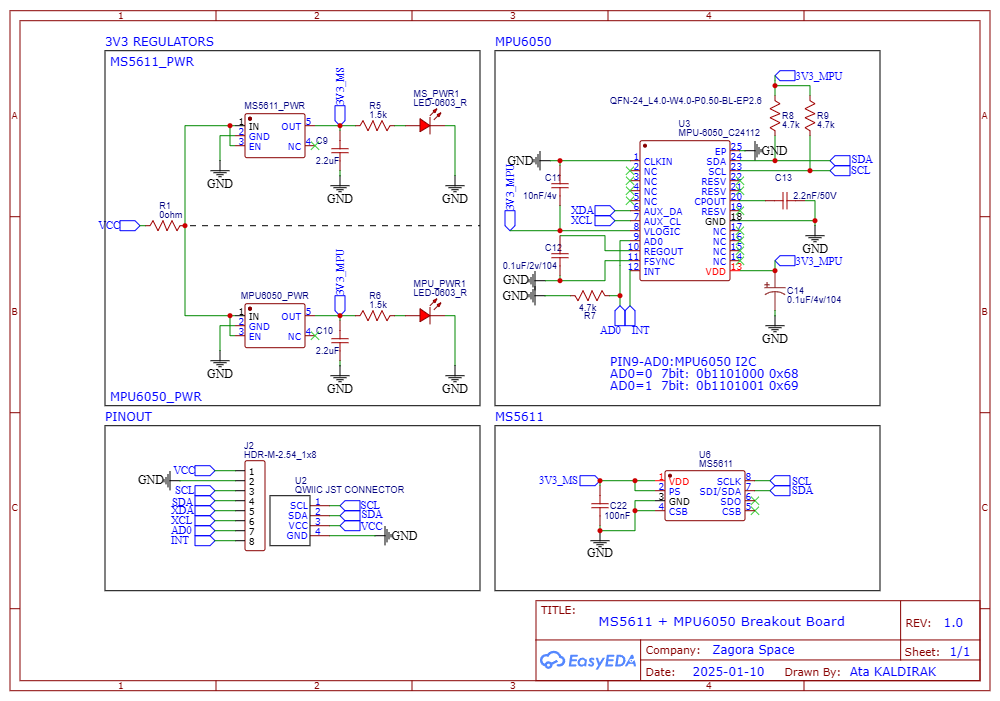
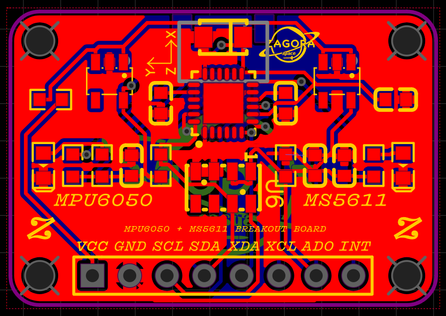

# MPU6050 + MS5611 Breakout Board

This repository contains my design files for a breakout board featuring the **MPU6050** 6-axis accelerometer/gyroscope and the **MS5611-01BA03** high-resolution altimeter/pressure sensor. This board is designed to be compact and easy to integrate into various projects, such as drones, rockets, or any application requiring precise motion and atmospheric data.

## Features

-   **Dual Sensors:** Integrates MPU6050 (3-axis gyroscope and accelerometer) and MS5611 (high-resolution pressure sensor).
-   **Stable Power Supply:** Each sensor has its own dedicated voltage regulator for improved stability and noise reduction.
-   **Compact Design:** A small form factor, ideal for space-constrained applications like rockets.
-   **Open-Source:** All design files, including schematics and PCB layouts, are available in this repository. (I plan to add the libraries I wrote for this sensor in the future.)

---

## Repository Contents

-   **`Schematic + PCB Layout/SCH_ms5611+mpu6050_2025-08-11.json`**: The schematic design file (EasyEda).
-   **`Schematic + PCB Layout/PCB_MPU6050-+-MS5611-BREAKOUT-BOARD-PCB_2025-08-11.json`**: The PCB layout design file (EasyEda).
-   **`finalgerberms_mpuyespanelize.zip`**: Ready-to-order Gerber files for the PCB.
-   **`images/`**: This directory contains images of the project, including the technical drawing and photos of the assembled board.

---

## Technical Drawings & Photos

### Technical Drawing

### Assembled Board

<table>
  <tr>
    <td></td>
    <td></td>
  </tr>
  <tr>
    <td></td>
    <td></td>
  </tr>
</table>

---

### SCHEMATIC AND PCB LAYOUT

<table>
  <tr>
    <td></td>
  </tr>
  <tr>
    <td></td>
  </tr>
</table>

---

## Usage

To use this board in your project, you can download the schematic and PCB files and use them with your preferred EDA software. The I²C pins can be connected to any microcontroller with an I²C interface. Libraries for both the MPU6050 and MS5611 are widely available for platforms like Arduino, ESP32, and Raspberry Pi.

---

## Contact

I can also provide the PCB for you. You can contact me via email at: **atakldrkpersonal@gmail.com**

---

## Contribution

Feel free to open an issue or submit a pull request if you have suggestions or improvements.

---

## License

This project is licensed under the **MIT License**.
