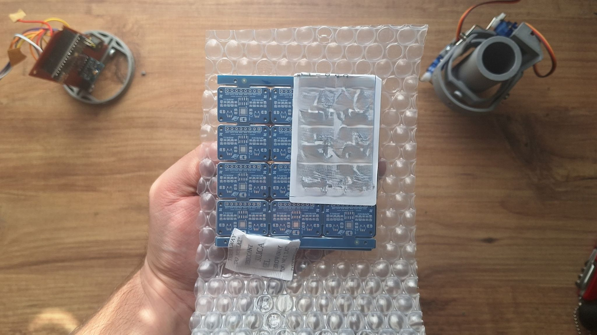

# MPU6050 + MS5611 Breakout Board
This repository contains my design files for a breakout board featuring the MPU6050 6-axis accelerometer/gyroscope and the MS5611-01BA03 high-resolution altimeter/pressure sensor. This board is designed to be compact and easy to integrate into various projects, such as drones, rockets, or any application requiring precise motion and atmospheric data.

## Features

-   **Dual Sensors:** Integrates MPU6050 (3-axis gyroscope and accelerometer) and MS5611 (high-resolution pressure sensor).
-   **Stable Power Supply:** Each sensor has its own dedicated voltage regulator for improved stability and noise reduction.
-   **Compact Design:** A small form factor, ideal for space-constrained applications like rockets.
-   **Open-Source:** All design files, including schematics and PCB layouts, are available in this repository. (I plan to add the libraries I wrote for this sensor in the future.)

## Files

This repository contains all the necessary design files for the breakout board:

-   **Schematic (`Schematic + PCB Layout/SCH_ms5611+mpu6050_2025-08-11.json`):** The circuit diagram of the board.
-   **PCB Layout (`Schematic + PCB Layout/PCB_MPU6050-+-MS5611-BREAKOUT-BOARD-PCB_2025-08-11.json`):** The physical layout of the printed circuit board.

*Note: These files are in EasyEDA format. You can open and edit them using the EasyEDA software.*

## Technical Drawings & Photos

Below are the technical drawing of the PCB and actual photos of the assembled board.

### Technical Drawing

### Assembled Board

Repository Contents
## Schematic + PCB Layout/SCH_ms5611+mpu6050_2025-08-11.json: The schematic design file (EasyEda).

## Schematic + PCB Layout/PCB_MPU6050-+-MS5611-BREAKOUT-BOARD-PCB_2025-08-11.json: The PCB layout design file (EasyEda). 

## finalgerberms_mpuyespanelize.zip: Ready to order gerber files of the PCB.

## images/: This directory contains images of the project, including the technical drawing and photos of the assembled board.

Usage
To use this board in your project, you can download the schematic and PCB files and use them with your preferred EDA software. The I²C pins can be connected to any microcontroller with an I²C interface. Libraries for both the MPU6050 and MS5611 are widely available for platforms like Arduino, ESP32, and Raspberry Pi.

## Also i can provide the PCB for you. You can contact me from my mail address: atakldrkpersonal@gmail.com

Contribution
Feel free to open an issue or submit a pull request if you have suggestions or improvements.

License
This project is licensed under the MIT License.
